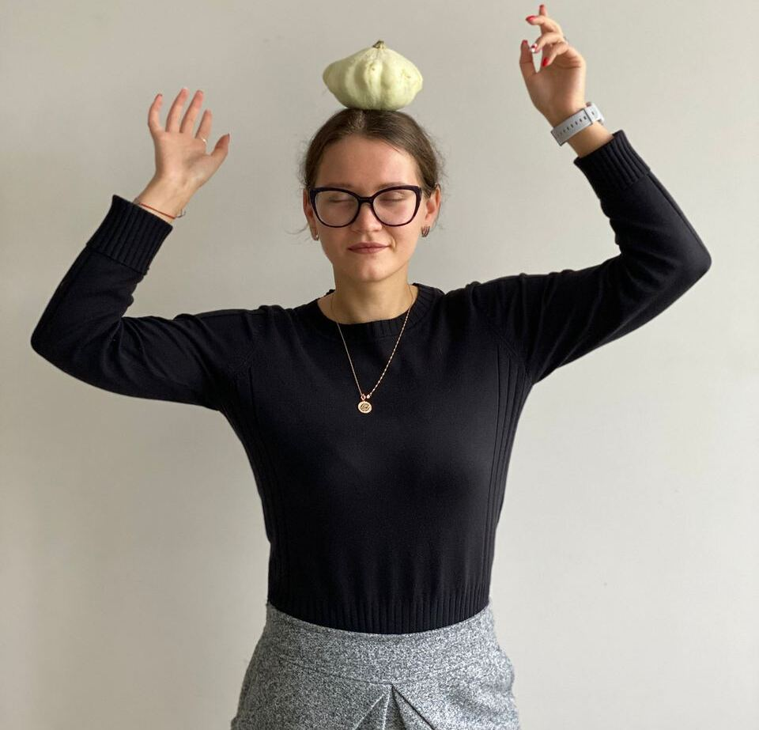

# Olga Kalacheva

Frontend developer, Minsk



## About me

I am 27 years old and I want to learn write code. Now I work as brand-manager and I really reckon that I should improve my skills. Digital-marketing is my daily routine, but now I want to look 'under the hood'. Wish me luck!

## Skills

I work in such programs as

- HTML
- Figma
- JS
- GITHUB

## Portfolio

```
function greeting {
  console.log ('Hello World!')
};

```

examples of training projects


## Education

BELARUS STATE ECONOMIC UNIVERSITY - master degree
**English** - B1 | **French** - A2 | **Russian** - native | **Belarusian** - native

## My contacts:

Want to know more or just chat? You are welcome!

- E-mail: <kalach2256954@gmail.com>
- Mobile Phone: +375 29 225 69 54

- [LinkedIn](https://www.linkedin.com/in/%D0%BE%D0%BB%D1%8C%D0%B3%D0%B0-%D0%BA%D0%B0%D0%BB%D0%B0%D1%87%D1%91%D0%B2%D0%B0-331ba5231/)
- [Instagram](https://github.com/kalachyonok)
- [Telegram](https://t.me/calachyonok)
- [ВК](https://vk.com/id95509983)
- [GitHub](https://github.com/kalachyonok)
